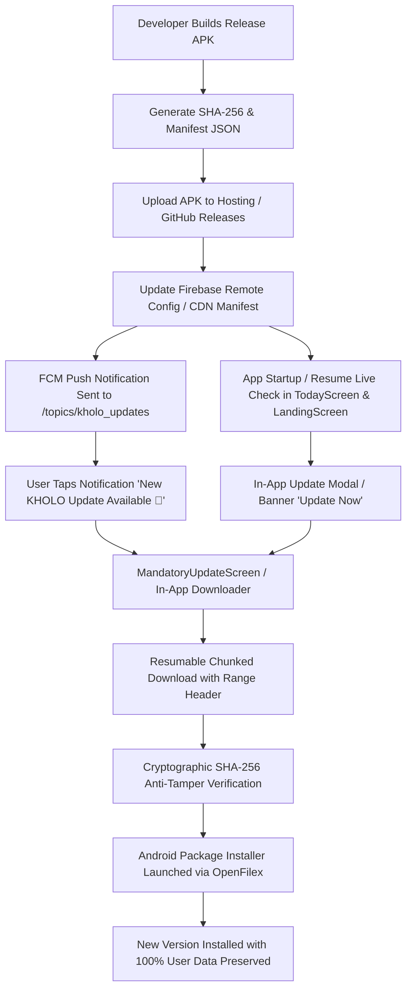

# 🌸 KHOLO Private Distribution & Auto Update System Guide

This document outlines the complete developer release workflow, private update distribution architecture, and automated verification pipeline for the **KHOLO** app without Google Play Store dependencies.

---

## 1. 🏗️ Architecture Overview



---

## 2. 🚀 Developer Release Workflow (In 3 Simple Steps)

### Step 1: Run the Automated Release Script
Run the automated build script from the project root:

```powershell
.\scripts\release_apk.ps1 -Version "1.4.0" -BuildNumber 22
```

*(Or on any OS: `flutter build apk --release` followed by `dart run scripts/generate_release_manifest.dart`)*

This script automatically:
1. Validates the code with `flutter analyze`.
2. Runs all 51 test suites with `flutter test`.
3. Builds the optimized release APK (`build/app/outputs/flutter-apk/app-release.apk`).
4. Computes the cryptographic **SHA-256 hash** and exact byte size.
5. Generates the ready-to-paste `version.json` manifest.

---

### Step 2: Upload APK to Hosting
1. Go to your GitHub Repository: `https://github.com/Blackproxya2z/kholo-app/releases`
2. Create a new Release tagged `v1.4.0`.
3. Upload `build/app/outputs/flutter-apk/app-release.apk`.
4. Publish the Release.

---

### Step 3: Publish Remote Config & Push Notification

1. Open **Firebase Console** -> **Remote Config**.
2. Update the parameter `app_update_info` with the JSON printed by the script:
```json
{
  "latestVersion": "1.4.0",
  "versionCode": 22,
  "buildNumber": 22,
  "minRequiredVersionCode": 20,
  "minimumSupportedVersion": "1.0.0",
  "updateTitle": "New KHOLO Update Available 🌸",
  "updateMessage": "A new version of KHOLO is ready. Update now to enjoy new features.",
  "releaseNotes": [
    "Enhanced on-device health privacy & encrypted baselines",
    "Refined cycle & ovulation prediction algorithms",
    "Interactive pregnancy kick counter & contraction timer",
    "Multi-baby timeline logs & developmental milestones",
    "Intelligent AI skin wellness companion with zero battery drain"
  ],
  "apkUrl": "https://github.com/Blackproxya2z/kholo-app/releases/download/v1.4.0/app-release.apk",
  "apkSha256": "4b54e7d95393081e7d82914db4983057e056ba63d08f7107775080bc064aa3c7",
  "fileSize": 68157440,
  "forceUpdate": false,
  "optionalUpdate": true
}
```
3. Click **Publish changes**.
4. *(Optional Push)* Send an FCM broadcast to `/topics/kholo_updates` with Title: `"New KHOLO Update Available 🌸"`.

---

## 3. 📱 User Experience Matrix

| State | User Experience |
| :--- | :--- |
| **App Closed** | Receives system status bar heads-up notification with sound & vibration. Tapping launches the app directly into the update download screen. |
| **App in Background** | Receives high-priority status bar alert. Resuming app triggers the live update banner & prompt. |
| **App in Foreground** | Instantly displays glowing update banner on dashboard and floating update modal with live changelog. |
| **Optional Update** | User can choose **"Update Now"** or **"Later"**. |
| **Force Update** | When `forceUpdate == true` or `minRequiredVersionCode > installedCode`, user must update to continue. |

---

## 4. 🛡️ Security & Data Safety Guarantees

1. **SHA-256 Integrity Verification**:
   The downloaded file is verified against the remote SHA-256 signature stream before the system installer is invoked. Corrupted or tampered files are automatically deleted and rejected.
2. **Zero Data Loss Guarantee**:
   All user health records, cycle history, baby profiles, and preferences stored in SQLite and SharedPreferences are preserved across updates via Android's native package manager (`MY_PACKAGE_REPLACED`).
3. **Android Compatibility (API 26 to API 35)**:
   Configured with Android `FileProvider`, `REQUEST_INSTALL_PACKAGES` permission, and `POST_NOTIFICATIONS` runtime permission checks.
